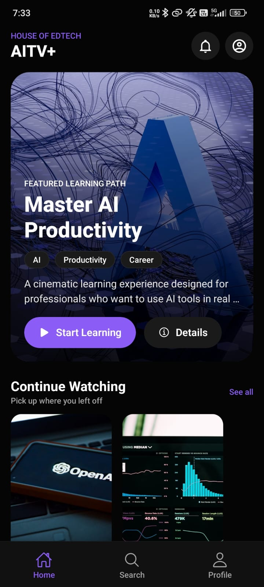
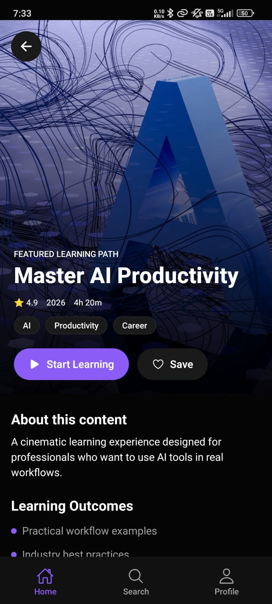
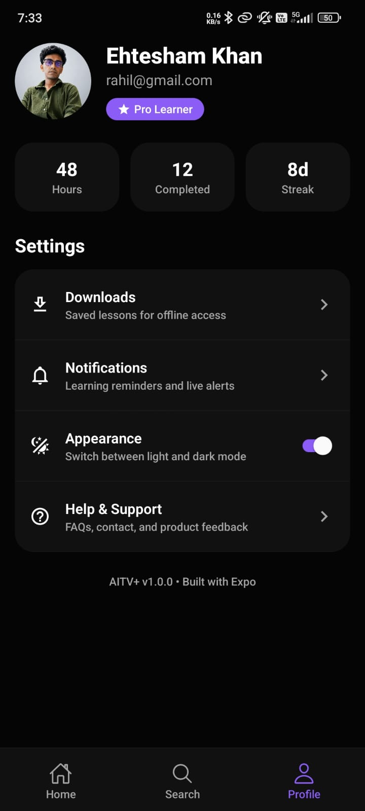

# 🚀 House of EdTech – AITV+ (Expo React Native Assignment)

A production-inspired mobile learning application built with **React Native (Expo)** and **TypeScript**, following modern mobile architecture and best engineering practices.

The application is inspired by modern streaming and content-discovery platforms such as **Disney+ Hotstar**, **AITV**, and **Sofascore**, while maintaining its own UI, reusable architecture, and scalable codebase.

---

# ✨ Features

## Home

- Beautiful Hero Banner
- Horizontal Content Carousels
- Continue Learning Section
- Live Badge
- Pull to Refresh
- Optimized FlatList

---

## Detail

- Hero Banner
- Course Metadata
- Learning Outcomes
- Related Courses
- Rich Scrollable Layout
- Back Navigation

---

## Search

- Live Search
- Filter Chips
- Empty State
- Dynamic Results
- Optimized Rendering

---

## Profile

- User Profile
- Statistics
- Settings Sections
- Menu Items
- Dark / Light Theme

---

## UI States

- Skeleton Loading
- Empty State
- Error State
- Pull To Refresh
- Theme Switching

---

# 🛠 Tech Stack

- Expo SDK 54
- React Native 0.81
- TypeScript
- React Navigation
- React Query (TanStack)
- Zustand
- Expo Image
- Expo Linear Gradient
- FlatList
- React Native Paper

---

# 📂 Folder Structure

```
src
│
├── api
│   ├── services
│   ├── client.ts
│   └── endpoints.ts
│
├── components
│   ├── cards
│   ├── carousel
│   ├── common
│   ├── skeleton
│   └── ui
│
├── constants
├── config
├── data
├── hooks
├── navigation
├── screens
│   ├── Home
│   ├── Details
│   ├── Search
│   └── Profile
│
├── store
├── theme
├── types
└── utils
```

---

# 🧠 Architecture

```
UI

↓

Screen Components

↓

Custom Hooks

↓

React Query

↓

Service Layer

↓

Mock API

↓

JSON Data
```

Business logic is completely separated from UI.

All screens consume data through hooks instead of directly importing JSON.

---

# 🎨 Theme System

- Dark Mode
- Light Mode
- Typography
- Spacing
- Radius
- Shadows
- Colors

Managed globally using **Zustand**.

---

# ⚡ Performance Optimizations

- FlatList
- React.memo
- useMemo
- useCallback
- Component-based architecture
- Reusable UI
- Image optimization using expo-image
- Type-safe navigation
- Lazy mock API
- Async service abstraction

---

# 📡 Mock API Layer

Instead of directly consuming JSON inside UI,

the application uses

```
Screen

↓

Hook

↓

React Query

↓

Service

↓

Mock API

↓

JSON
```

This allows replacing the mock layer with real backend APIs without changing UI components.

---

# 📱 Navigation

- Native Stack
- Bottom Tabs
- Typed Navigation
- Screen Separation

---

# 📦 Installation

Clone the repository

```bash
git clone <repository-url>
```

Install dependencies

```bash
npm install
```

Run

```bash
npx expo start
```

Android

```bash
npm run android
```

iOS

```bash
npm run ios
```

---

# 🏗 Build

Using Expo

```bash
eas build --platform android
```

---

# 📸 Screenshots

| Home                                  | Detail                                    |
| ------------------------------------- | ----------------------------------------- |
|  |  |

| Search                                    | Profile                                     |
| ----------------------------------------- | ------------------------------------------- |
|  |  |

---

# 🎥 Demo Video

▶ **Application Demo (2 Minutes)**

https://drive.google.com/file/d/1404bBwkJXIWMLNr6r0hc31EqByZ7oX2t/view?usp=sharing

---

# 📌 Assignment Highlights

✔ Expo Managed Workflow

✔ TypeScript Strict Mode

✔ React Navigation

✔ Zustand State Management

✔ React Query

✔ Production Folder Structure

✔ Reusable Components

✔ Data Driven UI

✔ Loading / Empty / Error States

✔ Optimized Lists

✔ Pull To Refresh

✔ Dark / Light Theme

---

# 👨‍💻 Author

**Ehtesham Khan**

React Native Developer

GitHub:
https://github.com/Ehteshammkhan

---

Thank you for reviewing my submission.
